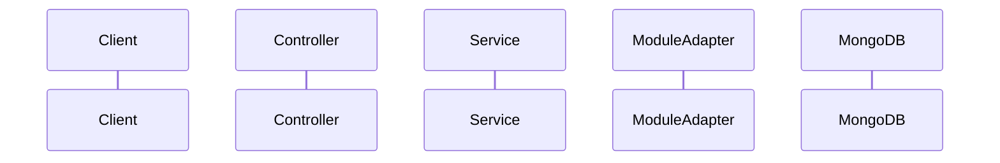

# Feature Design: <Feature Name>

## Source Issue
`docs/issues/<issue-file>.md`

---

## 1. Problem Statement
*Concise definition of the business problem, current system limitations, and why this initiative is necessary.*

---

## 2. Customer / Consumer
*Identify who consumes this feature: Frontend UI, Algo Trader, External Broker, Cron Engine, or Internal Module.*

---

## 3. Goals
- **G-1**: Primary business or technical goal.
- **G-2**: Secondary functional goal.

---

## 4. Non-Goals
- **NG-1**: Explicitly out-of-scope requirements or features deferred to future phases.

---

## 5. Existing Architecture
*Summary of existing modules, database schemas, and workflows currently handling this domain area.*

---

## 6. Proposed Architecture
*High-level architectural overview, sequence diagram (Mermaid), and component interactions.*

---

## 7. Module Impact
*List affected Spring Modulith modules (`domain`, `common`, `identity`, `datafeed`, `strategy`, `trading`, `journal`, `alert`) and new/modified `@NamedInterface("adapter")` contracts.*

---

## 8. API Design
*Overview of new or modified REST/WebSocket endpoints, request payloads, and response structures.*

---

## 9. Data Design
*MongoDB document models, collection names, indexing requirements (`@Indexed`, compound indexes), and data retention policies.*

---

## 10. Event / Async Design
*Spring Modulith transactional application events, Temporal workflows/activities, and WebSocket topics.*

---

## 11. Security Design
*Authentication rules, authorization roles, data sanitization, and secret protection.*

---

## 12. Failure Scenarios & Fault Tolerance
*Analysis of partial failure states, network timeouts, downstream dependency outages, and Resilience4j fallbacks.*

---

## 13. Scalability & Performance Considerations
*Expected throughput, memory footprints, lock-free concurrency, query latency, and database growth impact.*

---

## 14. Observability & Telemetry
*Structured logging identifiers (MDC), Micrometer metrics, and health check indicators.*

---

## 15. Alternatives Considered
*Alternative designs, tradeoffs evaluated, and the rationale for choosing the proposed approach.*

---

## 16. Risks & Mitigations
*Technical or operational risks and concrete mitigation steps.*

---

## 17. Assumptions
*Explicit assumptions regarding business behavior, third-party availability, or data structures.*

---

## 18. Open Questions
*Unresolved questions requiring stakeholder or developer feedback.*

---

## 19. Implementation Plan
*High-level sequencing of tasks for Loki (LLD) and Thor (Implementation).*

---

## 20. Testing Strategy
*Strategy across Unit, Integration (Testcontainers), Application E2E, and Bruno API E2E testing.*

---

## 21. Rollout & Migration Strategy
*Database migration considerations, backward compatibility safeguards, and rollout sequence.*
