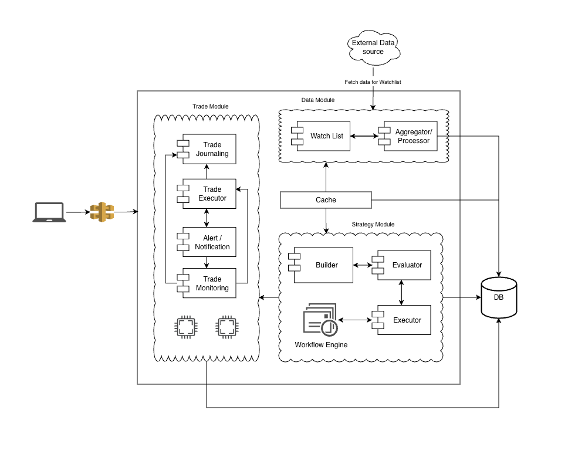

### tragepro

Backend for auto trader app

# Architecture

The system follows a **modular event-driven trading architecture**.

## Architecture Overview

The platform consists of several core components:

### Data Layer
- **External Data Source** → provides market data
- **Data Aggregator** → normalizes and processes incoming data
- **Database** → persistent storage

### Strategy Layer
- **Strategy Builder** → builds strategies from configuration
- **Strategy Evaluator** → validates strategy conditions
- **Strategy Executor** → triggers strategy execution

### Trading Layer
- **Trade Manager** → manages trade lifecycle
- **Trade Journaling** → records trade history
- **Workflow Executor** → orchestrates workflows

### Support Components
- **Cache** → fast access to frequently used data
- **Watch List** → tracks instruments for strategies
