# TragePro Backend API (`tragepro-api`)

[]()
[]()
[]()
[]()

Backend API service for **TragePro** — an automated domain-driven algorithmic trading platform built with Java, Spring Boot, Spring Modulith, Temporal SDK, and MongoDB.

---

## 🏛 Architecture & Design System

The application follows a **Domain-Driven Flat Modulith Architecture**. Monolithic complexity is governed via Spring Modulith boundary rules, explicit module contracts (`@ApplicationModule(type = OPEN)`), and Gang-of-Four design patterns.


---

## 📦 Core Modules

```
src/main/java/com/tragepro/api/
├── core/                   # OPEN Core Foundation (BaseActivity, ActivityRegistry, Pipeline, Security, Temporal, Persistence, Web, Exceptions, Mappers, Primitives)
├── marketdata/             # Market Data Feeds (FeedAdapterFactory, TimeframesUtil, Concurrent Contexts, Services, REST API)
├── strategy/               # Algorithmic Trading (Pipeline Steps, Temporal Workflows/Activities, Definitions)
├── identity/               # User Authentication & Profile Management
├── journal/                # Trade Log Journaling & Historical Performance Notes
├── trading/                # Order Lifecycle Management & Portfolio Position Tracking
└── notification/           # Multi-Channel Alert Events & Message Dispatching
```

### Module Breakdown & Design Patterns

| Module | Design Patterns Applied | Responsibilities |
| :--- | :--- | :--- |
| **`core`** | Template Method, Chain of Responsibility, Registry | Shared kernel (`@ApplicationModule(type = OPEN)`) containing `BaseActivity`, `Pipeline`, `ActivityRegistry`, `SecurityConfig`, `JWTAuthFilter`, `TemporalConfig`, global exception handling, base models, and class-based `MapperFactory`. |
| **`marketdata`**| Factory, Profile Strategy | Market data feed ingestion (`DataFeedAdapter`, `FeedAdapterFactory`, `DummyFeedAdapter`, `FeedClientAdapter`), `TimeframesUtil`, thread-safe `ConcurrentHashMap` contexts (`DatafeedContext`, `WatchlistContext`). |
| **`strategy`** | Chain of Responsibility, State Machine, Strategy | Pipeline processing (`builder/`, `evaluator/`, `executor/`), Temporal workflows (`DataInitWorkflowImpl`), and strategy implementations (`IntradayStrategy`, `SwingStrategy`). |
| **`trading`** | Façade, Command | Portfolio position tracking (`TradingService`) and order execution (`OrderManager`). |
| **`identity`** | Proxy, Service Layer | User authentication (`AuthenticationService`) and account management (`AccountDetailService`). |
| **`journal`** | Repository, Filter | Trade log journaling (`JournalService`) and performance filtering. |
| **`notification`**| Observer / Event Driven, Factory, Strategy | Spring Modulith `@ApplicationModuleListener` event handling (`AlertEventPublisher`, `AlertEventListener`) and multi-channel dispatchers (`NotificationChannelFactory`). |

---

## 🔄 The 6 Core System Flows

```mermaid
flowchart TD
    %% Flow 1: Security & Auth
    subgraph Flow1 ["Flow 1: Core Security & JWT Authentication (core/security)"]
        A1[HTTP Request] --> A2[JWTAuthFilter]
        A2 --> A3[UserDetailServiceImpl / JwtTokenHelper]
        A3 --> A4[Security Context Established]
    end

    %% Flow 2: Market Data Ingestion
    subgraph Flow2 ["Flow 2: Market Data Ingestion (marketdata)"]
        B1[Client / Cron] --> B2[DataFeedController]
        B2 --> B3[DatafeedServiceImpl package-private]
        B3 --> B4{FeedAdapterFactory}
        B4 -->|Prod| B5[FeedClientAdapter]
        B4 -->|Dev/Local| B6[DummyFeedAdapter]
        B5 & B6 --> B7[DatafeedContext ConcurrentHashMap]
        B7 --> B8[(MongoDB)]
    end

    %% Flow 3: Temporal Worker Auto-Registration
    subgraph Flow3 ["Flow 3: Temporal Worker Auto-Registration (core/temporal & core/workflow)"]
        C1[Temporal Worker Engine] --> C2[TemporalConfig]
        C2 --> C3[WorkflowRegistry & ActivityRegistry]
        C3 --> C4[DataInitWorkflowImpl]
        C4 --> C5[DataInitActivityImpl BaseActivity]
        C5 --> C6[StrategyContext]
    end

    %% Flow 4: Strategy Pipeline Execution
    subgraph Flow4 ["Flow 4: Strategy Pipeline Chain (strategy/pipeline)"]
        D1[Strategy Request] --> D2[StrategyBuilder Chain]
        D2 --> D3[Build OHLCV, Volume, VWAP, Levels]
        D3 --> D4[StrategyEvaluator]
        D4 --> D5[StrategyExecutor Buy/Sell/Notify]
        D5 --> D6[StrategyResponse Result]
    end

    %% Flow 5: Trading & Order Execution
    subgraph Flow5 ["Flow 5: Portfolio Position & Order Execution (trading)"]
        E1[Client / Strategy Signal] --> E2[OrderController]
        E2 --> E3[TradingServiceImpl package-private]
        E3 --> E4[OrderManagerImpl package-private]
        E4 --> E5[JournalService Trade Log]
        E5 --> E6[(MongoDB Orders & Journal)]
    end

    %% Flow 6: Multi-Channel Alert Notification
    subgraph Flow6 ["Flow 6: Event Alert Notification (notification)"]
        F1[Domain Component Event] --> F2[AlertEventPublisher]
        F2 --> F3[Spring ApplicationEvent]
        F3 --> F4[AlertEventListener]
        F4 --> F5[NotificationChannelFactory]
        F5 --> F6[Email / Telegram / Webhook Channel]
    end
```



---

## 🛠 Prerequisites & Local Setup

### Requirements
- **Java 21** or **Java 25**
- **Gradle 8.x+**
- **MongoDB** (or Docker for Testcontainers)

### Build & Test Commands

```bash
# Code formatting check and auto-apply
./gradlew spotlessApply

# Compile code across all modules
./gradlew compileJava compileTestJava

# Execute all unit, integration, and Testcontainers E2E tests
./gradlew test

# Verify JaCoCo code coverage (Requires >= 95%)
./gradlew jacocoTestCoverageVerification

# Full build verification
./gradlew clean check
```

---

## 🧪 Bruno API Collection

REST API requests are available in the [`bruno/`](bruno/) directory. Use [Bruno](https://www.usebruno.com/) to import the collection and test authentication, market data feed endpoints, strategy execution, and trade journaling.
