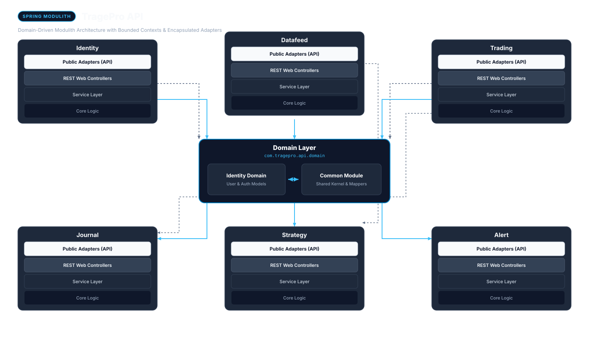
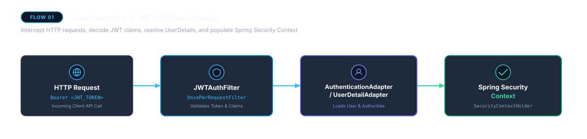
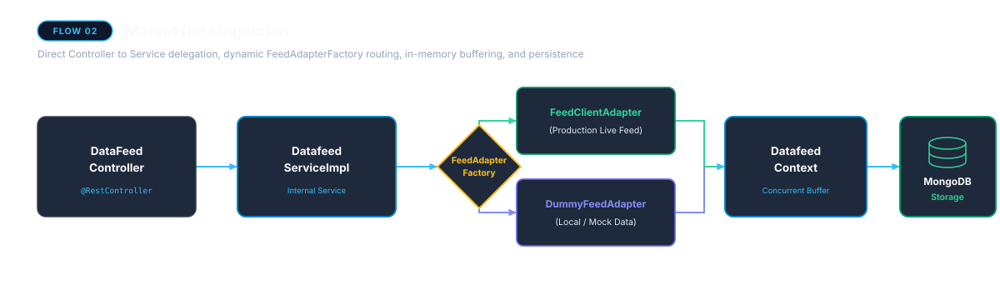
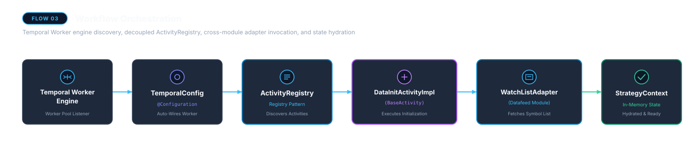
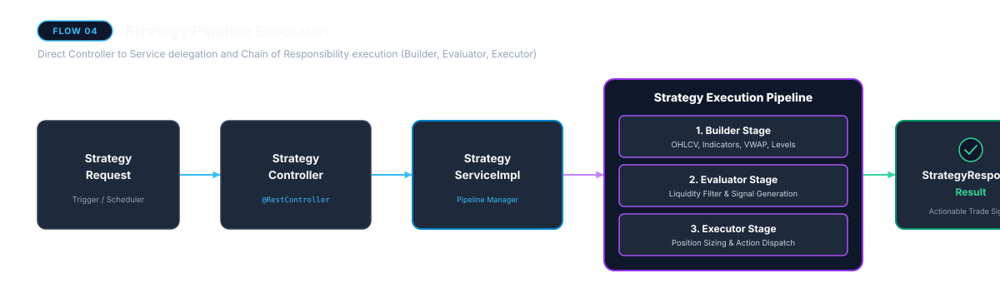
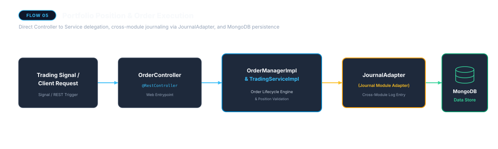
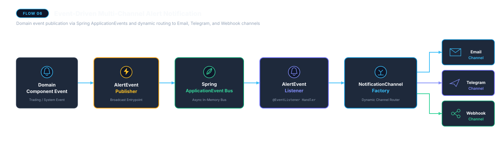

# TragePro Backend API (`tragepro-api`)

[]()
[]()
[]()
[]()

Backend API service for **TragePro** — an automated domain-driven algorithmic trading platform built with Java, Spring Boot, Spring Modulith, Temporal SDK, and MongoDB.

---

## 🏛 Architecture & Design System

The application follows a **Modular Monolith (Spring Modulith)** architecture. System encapsulation is governed by explicit Spring Modulith boundary rules, dedicated single-responsibility Adapters acting as public entry points (`@NamedInterface("adapter")`), and open domain models.



---

## 📦 Core Modules

```
src/main/java/com/tragepro/api/
├── domain/                 # OPEN Domain Layer (Entities, DTO Requests/Responses, Domain Models, Enums)
├── common/                 # OPEN Common Kernel (Shared Utilities, Exceptions, Base Models, Mappers)
├── identity/               # User Authentication & Profile Management (Adapters, Web, Service, Core)
├── datafeed/               # Market Data Feeds & Watchlists (Adapters, Web, Service, Core)
├── strategy/               # Algorithmic Trading Strategies & Workflows (Adapters, Web, Service, Core)
├── trading/                # Order Lifecycle Management & Portfolio Tracking (Adapters, Web, Service, Core)
├── journal/                # Trade Log Journaling & Notes (Adapters, Web, Service, Core)
└── alert/                  # Multi-Channel Alert Events & Message Dispatching (Adapters, Web, Service, Core)
```

### Module Structure & Exposed Adapters

Each feature module is organized into 4 uniform internal layers:
- **`adapter/`**: Exposed Public Adapter entry points (`<Module>Adapter.java`) for cross-module boundary access.
- **`web/`**: REST Controllers (`@RestController`) consuming internal Services directly.
- **`service/`**: Service interfaces, private implementations (`service.impl`), and MapStruct mappers (`service.mapper`).
- **`core/`**: Internal business logic, repositories, contexts, events, and workflows.

| Module | Exposed Public Adapters (`@NamedInterface("adapter")`) | Responsibilities |
| :--- | :--- | :--- |
| **`domain`** | Open Module (`@ApplicationModule(type = OPEN)`) | Central domain entities, request DTOs, response DTOs, models, and enums open to all modules. |
| **`common`** | Open Module (`@ApplicationModule(type = OPEN)`) | Shared kernel containing global exception handling, common mappers, object cloning, and base utilities. |
| **`identity`** | `AuthenticationAdapter`, `AccountDetailAdapter`, `UserDetailAdapter` | User authentication, account management, and profile details. |
| **`datafeed`** | `CandleAdapter`, `SecurityAdapter`, `WatchListAdapter`, `DatafeedAdapter` | Market data feed ingestion, historical candle querying, and watchlist management. |
| **`strategy`** | `StrategyAdapter`, `ConfigLoaderAdapter` | Algorithmic strategy evaluation, config loading, and workflow activity orchestrations. |
| **`trading`** | `TradingAdapter`, `OrderAdapter` | Order lifecycle execution (`OrderManager`) and portfolio position tracking (`TradingService`). |
| **`journal`** | `JournalAdapter` | Trade log journaling and performance note filtering. |
| **`alert`** | `NotificationAdapter` | Event-driven alert publishing (`AlertEventPublisher`), listeners, and multi-channel notification dispatchers. |

---

## 🔄 The 6 Core System Flows

### Flow 1: Core Security & JWT Authentication
Incoming HTTP requests pass through `JWTAuthFilter`, authenticating user credentials via `AuthenticationService` / `UserDetailService` and establishing the Spring Security Context.



---

### Flow 2: Market Data Ingestion
`DataFeedController` receives feed requests and delegates directly to `DatafeedServiceImpl`. The internal `FeedAdapterFactory` routes execution dynamically to `FeedClientAdapter` (in Production) or `DummyFeedAdapter` (in Local/Dev), caching ticks in `DatafeedContext` before MongoDB persistence.



---

### Flow 3: Temporal Workflow Orchestration
The Temporal Worker Engine registers workflow activities (`DataInitActivityImpl`) using `ActivityRegistry`. The activity fetches symbol watchlists via `WatchListAdapter` from the `datafeed` module and updates `StrategyContext`.



---

### Flow 4: Strategy Execution Pipeline
Strategy execution requests received by `StrategyController` invoke `StrategyServiceImpl`. The strategy chain executes through Builder, Evaluator, and Executor activity components to produce a `StrategyResponse`.



---

### Flow 5: Portfolio Position & Order Execution
Trading signals or client requests hit `OrderController`, passing directly to `OrderManagerImpl` and `TradingServiceImpl`. Executed orders are logged to trade journals via the cross-module `JournalAdapter` and persisted in MongoDB.



---

### Flow 6: Event-Driven Multi-Channel Alert Notification
Domain events trigger `AlertEventPublisher`, broadcasting events over Spring's ApplicationEvent bus. `AlertEventListener` receives events and delegates to `NotificationChannelFactory`, routing alerts dynamically to Email, Telegram, or Webhook channels.



---

## 🛠 Prerequisites & Local Setup

### Requirements
- **Java 21** or **Java 25**
- **Gradle 8.x+**
- **MongoDB** (or Docker for Testcontainers)

### Build & Test Commands

```bash
# Code formatting check and auto-apply
./gradlew spotlessApply

# Compile code across all modules
./gradlew compileJava compileTestJava

# Execute all unit, integration, and Spring Modulith verification tests
./gradlew test

# Full build verification
./gradlew clean check
```

---

## 🧪 Bruno API Collection

REST API requests are available in the [`bruno/`](bruno/) directory. Use [Bruno](https://www.usebruno.com/) to import the collection and test authentication, market data feed endpoints, strategy execution, and trade journaling.
