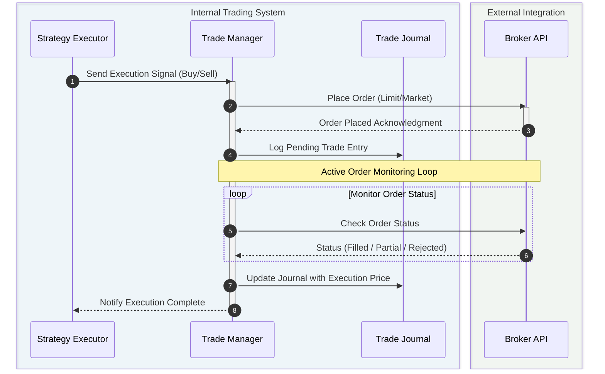

### tragepro

Backend for auto trader app

# Architecture

The system follows a **modular event-driven trading architecture**.


## Architecture Overview

The platform consists of several core components:

### Data Layer
- **External Data Source** → provides market data
- **Data Aggregator** → normalizes and processes incoming data
- **Database** → persistent storage

### Strategy Layer
- **Strategy Builder** → builds strategies from configuration
- **Strategy Evaluator** → validates strategy conditions
- **Strategy Executor** → triggers strategy execution

### Trading Layer
- **Trade Manager** → manages trade lifecycle
- **Trade Journaling** → records trade history
- **Workflow Executor** → orchestrates workflows

### Support Components
- **Cache** → fast access to frequently used data
- **Watch List** → tracks instruments for strategies

## Workflows

### 1. Scanning Stocks for Strategy Setup
This flow runs continuously or on a schedule to filter the broader market universe for stocks matching your specific strategy parameters.

```mermaid
flowchart TD
    %% Styling Definitions
    classDef default fill:#f9f9f9,stroke:#e0e0e0,stroke-width:1px,color:#333
    classDef trigger fill:#e1f5fe,stroke:#0288d1,stroke-width:2px,color:#000
    classDef process fill:#ffffff,stroke:#9e9e9e,stroke-width:1px,color:#000
    classDef decision fill:#fff3e0,stroke:#f57c00,stroke-width:2px,color:#000
    classDef action fill:#e8f5e9,stroke:#388e3c,stroke-width:2px,color:#000

    Start([Start Scan]) ::: trigger
    End([End Scan]) ::: trigger
    
    subgraph Pipeline [Scan & Evaluate]
        direction TD
        FetchData[Fetch Market Data for Universe] ::: process
        ApplyFilters[Apply Technical / Fundamental Filters] ::: process
        EvaluateStrategy[Evaluate Strategy Conditions] ::: process
        Decision{Setup Found?} ::: decision
        
        FetchData --> ApplyFilters --> EvaluateStrategy --> Decision
    end
    
    Start --> FetchData
    
    Decision -- " Yes " --> AddWatchlist[Add Stock to Watchlist] ::: action
    Decision -- " No " --> NextStock[Check Next Stock] ::: process
    
    NextStock -.->|Loop| FetchData
    AddWatchlist --> End
```

### 2. Observing for Correct Price Range
Once a stock is on the Watchlist, it is observed in real-time. When the price hits the desired entry range, execution is triggered.

```mermaid
flowchart TD
    %% Styling Definitions
    classDef trigger fill:#e1f5fe,stroke:#0288d1,stroke-width:2px,color:#000
    classDef process fill:#ffffff,stroke:#9e9e9e,stroke-width:1px,color:#000
    classDef decision fill:#fff3e0,stroke:#f57c00,stroke-width:2px,color:#000
    classDef action fill:#e8f5e9,stroke:#388e3c,stroke-width:2px,color:#000

    Start([Start Observation]) ::: trigger
    Wait[Wait for Next Tick] ::: process
    TriggerTrade[Trigger Trade Execution] ::: action
    
    subgraph Pipeline [Monitor & Validate]
        direction TD
        Monitor[Monitor Watchlist Stocks] ::: process
        FetchPrice[Fetch Real-Time Price/Candles] ::: process
        CheckRange{Price in Target Zone?} ::: decision
        Validate[Validate Trigger Conditions] ::: process
        Confirm{Conditions Met?} ::: decision
        
        Monitor --> FetchPrice --> CheckRange
        CheckRange -- " Yes " --> Validate --> Confirm
    end

    Start --> Monitor
    Confirm -- " Yes " --> TriggerTrade
    
    CheckRange -- " No " --> Wait
    Confirm -- " No " --> Wait
    Wait -.->|Loop| Monitor
```

### 3. Trade Execution Flow
The sequence of events from the moment a setup is triggered to the order being placed with the broker and recorded in the journal.


