# TragePro Backend API (`tragepro-api`)

[]()
[]()
[]()
[]()

Backend API service for **TragePro** — an automated domain-driven algorithmic trading platform built with Java, Spring Boot, Spring Modulith, Temporal SDK, and MongoDB.

---

## 🏛 Architecture & Design System

The application follows a **Modular Monolith (Spring Modulith)** architecture. System encapsulation is governed by explicit Spring Modulith boundary rules, dedicated single-responsibility Adapters acting as public entry points (`@NamedInterface("adapter")`), and open domain models.


---

## 📦 Core Modules

```
src/main/java/com/tragepro/api/
├── domain/                 # OPEN Domain Layer (Entities, DTO Requests/Responses, Domain Models, Enums)
├── common/                 # OPEN Common Kernel (Shared Utilities, Exceptions, Base Models, Mappers)
├── identity/               # User Authentication & Profile Management (Adapters, Web, Service, Core)
├── datafeed/               # Market Data Feeds & Watchlists (Adapters, Web, Service, Core)
├── strategy/               # Algorithmic Trading Strategies & Workflows (Adapters, Web, Service, Core)
├── trading/                # Order Lifecycle Management & Portfolio Tracking (Adapters, Web, Service, Core)
├── journal/                # Trade Log Journaling & Notes (Adapters, Web, Service, Core)
└── alert/                  # Multi-Channel Alert Events & Message Dispatching (Adapters, Web, Service, Core)
```

### Module Structure & Exposed Adapters

Each feature module is organized into 4 uniform internal layers:
- **`adapter/`**: Exposed Public Adapter entry points (`<Module>Adapter.java`).
- **`web/`**: REST Controllers (`@RestController`) consuming Adapters.
- **`service/`**: Service interfaces, private implementations (`service.impl`), and MapStruct mappers (`service.mapper`).
- **`core/`**: Internal business logic, repositories, contexts, events, and workflows.

| Module | Exposed Public Adapters (`@NamedInterface("adapter")`) | Responsibilities |
| :--- | :--- | :--- |
| **`domain`** | Open Module (`@ApplicationModule(type = OPEN)`) | Central domain entities, request DTOs, response DTOs, models, and enums open to all modules. |
| **`common`** | Open Module (`@ApplicationModule(type = OPEN)`) | Shared kernel containing global exception handling, common mappers, object cloning, and base utilities. |
| **`identity`** | `AuthenticationAdapter`, `AccountDetailAdapter`, `UserDetailAdapter` | User authentication, account management, and profile details. |
| **`datafeed`** | `CandleAdapter`, `SecurityAdapter`, `WatchListAdapter`, `DatafeedAdapter` | Market data feed ingestion, historical candle querying, and watchlist management. |
| **`strategy`** | `StrategyAdapter`, `ConfigLoaderAdapter` | Algorithmic strategy evaluation, config loading, and workflow activity orchestrations. |
| **`trading`** | `TradingAdapter`, `OrderAdapter` | Order lifecycle execution (`OrderManager`) and portfolio position tracking (`TradingService`). |
| **`journal`** | `JournalAdapter` | Trade log journaling and performance note filtering. |
| **`alert`** | `NotificationAdapter` | Event-driven alert publishing (`AlertEventPublisher`), listeners, and multi-channel notification dispatchers. |

---

## 🔄 The 6 Core System Flows

```mermaid
flowchart TD
    %% Flow 1: Security & Auth
    subgraph Flow1 ["Flow 1: Core Security & JWT Authentication (identity)"]
        A1[HTTP Request] --> A2[JWTAuthFilter]
        A2 --> A3[AuthenticationAdapter / UserDetailAdapter]
        A3 --> A4[Security Context Established]
    end

    %% Flow 2: Market Data Ingestion
    subgraph Flow2 ["Flow 2: Market Data Ingestion (datafeed)"]
        B1[Client / Cron] --> B2[DataFeedController]
        B2 --> B3[DatafeedAdapter]
        B3 --> B4[DatafeedServiceImpl]
        B4 --> B5{FeedAdapterFactory}
        B5 -->|Prod| B6[FeedClientAdapter]
        B5 -->|Dev/Local| B7[DummyFeedAdapter]
        B6 & B7 --> B8[DatafeedContext]
        B8 --> B9[(MongoDB)]
    end

    %% Flow 3: Temporal Worker Auto-Registration
    subgraph Flow3 ["Flow 3: Workflow Orchestration (strategy/core/workflow)"]
        C1[Temporal Worker Engine] --> C2[TemporalConfig]
        C2 --> C3[ActivityRegistry]
        C3 --> C4[DataInitActivityImpl BaseActivity]
        C4 --> C5[WatchListAdapter]
        C5 --> C6[StrategyContext]
    end

    %% Flow 4: Strategy Execution
    subgraph Flow4 ["Flow 4: Strategy Execution (strategy)"]
        D1[Strategy Request] --> D2[StrategyController]
        D2 --> D3[StrategyAdapter]
        D3 --> D4[StrategyServiceImpl]
        D4 --> D5[StrategyResponse Result]
    end

    %% Flow 5: Trading & Order Execution
    subgraph Flow5 ["Flow 5: Portfolio Position & Order Execution (trading)"]
        E1[Client / Strategy Signal] --> E2[OrderController]
        E2 --> E3[OrderAdapter / TradingAdapter]
        E3 --> E4[OrderManagerImpl]
        E4 --> E5[JournalAdapter Trade Log]
        E5 --> E6[(MongoDB Orders & Journal)]
    end

    %% Flow 6: Multi-Channel Alert Notification
    subgraph Flow6 ["Flow 6: Event Alert Notification (alert)"]
        F1[Domain Event] --> F2[AlertEventPublisher]
        F2 --> F3[Spring ApplicationEvent]
        F3 --> F4[AlertEventListener]
        F4 --> F5[NotificationChannelFactory]
        F5 --> F6[Email / Telegram / Webhook Channel]
    end
```



---

## 🛠 Prerequisites & Local Setup

### Requirements
- **Java 21** or **Java 25**
- **Gradle 8.x+**
- **MongoDB** (or Docker for Testcontainers)

### Build & Test Commands

```bash
# Code formatting check and auto-apply
./gradlew spotlessApply

# Compile code across all modules
./gradlew compileJava compileTestJava

# Execute all unit, integration, and Spring Modulith verification tests
./gradlew test

# Full build verification
./gradlew clean check
```

---

## 🧪 Bruno API Collection

REST API requests are available in the [`bruno/`](bruno/) directory. Use [Bruno](https://www.usebruno.com/) to import the collection and test authentication, market data feed endpoints, strategy execution, and trade journaling.
