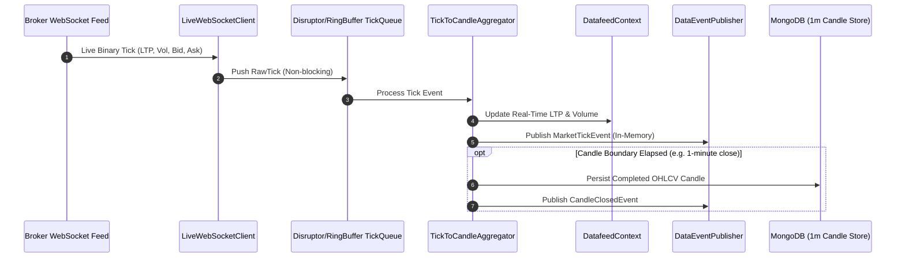

# [Flow 02: Market Data] Real-Time WebSocket Market Data Streaming & Tick Aggregation Engine

**Type**: Core Flow Implementation
**Module**: `datafeed`
**Labels**: `area:datafeed`, `core-flow`, `streaming`, `websocket`
**Priority**: High

---

## 1. Overview & Problem Statement
Currently, [`DatafeedServiceImpl`](file:///Users/dharam.dev/devspace/tragepro-api/src/main/java/com/tragepro/api/datafeed/service/impl/DatafeedServiceImpl.java) and [`FeedClientAdapter`](file:///Users/dharam.dev/devspace/tragepro-api/src/main/java/com/tragepro/api/datafeed/core/feed/FeedClientAdapter.java) support historical batch candle loading via REST API. In live trading hours, algorithmic strategies require sub-second live tick streaming over WebSockets to evaluate real-time signals without polling REST endpoints.

---

## 2. Proposed Architecture & Component Flow

---

## 3. Scope of Work

1. **`WebSocketClientManager`** (`com.tragepro.api.datafeed.core.feed.ws`):
   - Manage persistent WebSocket connection with exponential backoff reconnect and heartbeat ping/pong.
   - Subscription management for dynamic symbol lists from active watchlists.
2. **`TickToCandleAggregator`**:
   - Aggregate raw ticks into standard 1-minute, 5-minute, and 15-minute OHLCV candles in-memory.
   - Handle out-of-order ticks and market timestamp alignments.
3. **`DataEventPublisher` Integration**:
   - Broadcast `MarketTickEvent` and `CandleClosedEvent` across Spring Modulith event bus for strategy subscribers.
4. **WebSocket STOMP / SSE Endpoint** (`/ws/market-data`):
   - Expose client-facing WebSocket topics (e.g. `/topic/ticks/{symbol}`) for frontend dashboard streaming.

---

## 4. Acceptance Criteria

- [ ] WebSocket client maintains reliable connection and auto-reconnects on disconnection.
- [ ] Ingests >= 10,000 ticks/sec with < 5ms processing latency.
- [ ] Correctly forms OHLCV 1-minute candles from stream of raw ticks.
- [ ] Publishes `CandleClosedEvent` at each interval close to Spring event bus.
- [ ] Unit & integration tests achieve >= 95% line coverage.
