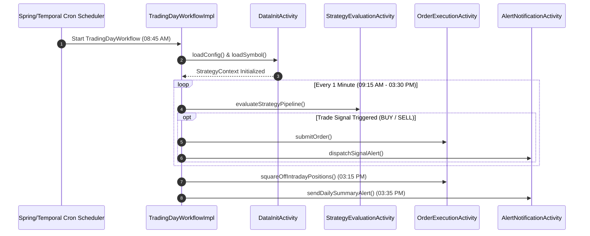

# [Flow 03: Workflow] End-to-End Temporal Workflow Lifecycle & Market Schedule Orchestration

**Type**: Core Flow Implementation
**Module**: `strategy`, `common`
**Labels**: `area:strategy`, `core-flow`, `temporal`, `orchestration`
**Priority**: High

---

## 1. Overview & Problem Statement
The strategy engine contains foundational activities (`DataInitActivityImpl`, `StrategyActivityImpl`) and registries (`ActivityRegistry`, `WorkflowRegistry`), but lacks a production-grade, stateful Temporal Workflow definition that executes the complete market day lifecycle (Pre-Market Init -> Market Open Monitoring Loop -> Signal Evaluation -> EOD Square-off / Teardown).

---

## 2. Proposed Architecture & Component Flow

---

## 3. Scope of Work

1. **`TradingDayWorkflow` Interface & Implementation**:
   - Define Temporal `@WorkflowInterface` with methods: `executeTradingDay(TradingDayRequest request)`, `@SignalMethod pauseTrading()`, `@SignalMethod resumeTrading()`, `@QueryMethod getWorkflowStatus()`.
2. **Dynamic Signal & Query Handlers**:
   - Enable operators to query live strategy state and inject signals (kill switch, emergency square-off) without restarting workers.
3. **Temporal Retry Policy & Activity Heartbeating**:
   - Configure non-retryable vs retryable activity exceptions with exponential backoff.
4. **EOD Workflow Archival**:
   - Persist workflow execution history and summary report into MongoDB.

---

## 4. Acceptance Criteria

- [ ] Complete workflow definition runs successfully on Temporal test environment.
- [ ] Workflow handles `pause` and `resume` signals idempotently.
- [ ] Emergency square-off signal cancels active orders and squares open positions.
- [ ] Unit & workflow integration tests achieve >= 95% line coverage.
