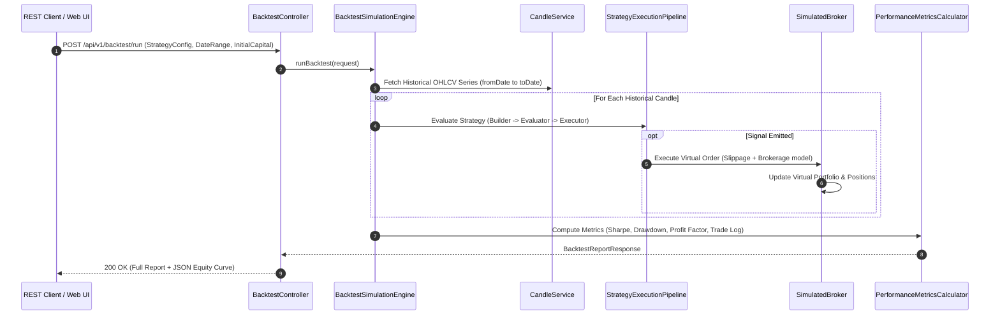

# [Flow 04: Strategy] Strategy Backtesting Simulation Engine & Performance Analytics

**Type**: Core Flow Implementation
**Module**: `strategy`
**Labels**: `area:strategy`, `core-flow`, `backtesting`, `analytics`
**Priority**: High

---

## 1. Overview & Problem Statement
TragePro currently executes strategies in live/forward evaluation mode. Traders require a historical Backtesting Simulation Engine to test strategy definitions against historical OHLCV data across custom date ranges, providing quantitative validation (Sharpe ratio, max drawdown, win rate, profit factor) before deploying capital.

---

## 2. Proposed Architecture & Component Flow

---

## 3. Scope of Work

1. **`BacktestSimulationEngine`**:
   - Time-travel historical candle replay loop ensuring no forward-looking bias (lookahead bias).
2. **`SimulatedBroker`**:
   - Realistic execution simulation with configurable slippage (e.g. 0.05%), transaction charges (STT, exchange fees, brokerage), and partial fills.
3. **`PerformanceMetricsCalculator`**:
   - Calculate financial metrics: Total Return %, CAGR, Annualized Volatility, Sharpe Ratio, Sortino Ratio, Maximum Drawdown (MDD), Win/Loss Ratio, Expectancy.
4. **`BacktestReport` & REST API**:
   - `/api/v1/backtest/run` and `/api/v1/backtest/reports/{id}` for querying past backtest runs.

---

## 4. Acceptance Criteria

- [ ] Accurate candle replay without lookahead bias.
- [ ] Slippage and transaction fees deducted realistically.
- [ ] Financial metrics match standard financial calculation benchmarks.
- [ ] Backtest execution is non-blocking (asynchronous for long date ranges).
- [ ] Unit & integration tests achieve >= 95% line coverage.
