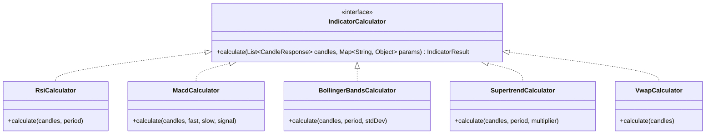

# [Flow 04: Strategy] Technical Indicator Calculation Library & Real-time Indicator Engine

**Type**: Core Flow Implementation
**Module**: `strategy`
**Labels**: `area:strategy`, `core-flow`, `indicators`, `math`
**Priority**: High

---

## 1. Overview & Problem Statement
The Strategy Pipeline's Builder stage (`StrategyBuilder`) requires built-in, vectorized technical indicator calculations (RSI, MACD, Bollinger Bands, EMA/SMA, ATR, Supertrend, VWAP) to populate `IndicatorModel` values accurately from historical OHLCV candle series.

---

## 2. Proposed Architecture & Component Flow

---

## 3. Scope of Work

1. **Indicator Interface & Registry**:
   - `IndicatorCalculator<T>` interface and `IndicatorRegistry` for pluggable calculations.
2. **Core Indicators Suite**:
   - **RSI** (Relative Strength Index - Wilder's Smoothing)
   - **MACD** (Moving Average Convergence Divergence + Signal Line + Histogram)
   - **EMA / SMA / WMA** (Exponential, Simple, Weighted Moving Averages)
   - **Bollinger Bands** (Upper, Middle SMA, Lower Band + %B)
   - **ATR** (Average True Range for dynamic volatility stop-loss)
   - **Supertrend** (ATR-based trend direction & trailing stop)
   - **VWAP** (Volume Weighted Average Price with intraday reset)
3. **Pipeline Builder Integration**:
   - Wire `IndicatorRegistry` into `StrategyBuilder` to enrich `StrategyContext` automatically during pipeline execution.

---

## 4. Acceptance Criteria

- [ ] All indicators verified against TA-Lib reference values with delta < 0.001%.
- [ ] Efficient array-based memory allocation (O(N) time complexity).
- [ ] Handles edge cases (insufficient candle count, zero volume, flat prices).
- [ ] Unit tests achieve >= 95% line coverage.
