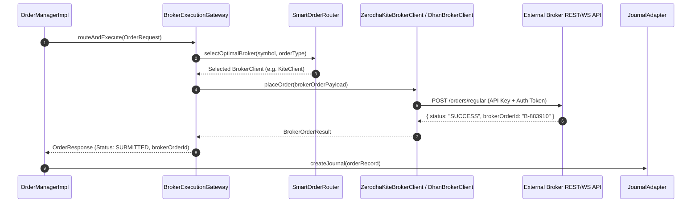

# [Flow 05: Trading] Broker API Execution Gateway & Smart Order Routing (SOR)

**Type**: Core Flow Implementation
**Module**: `trading`
**Labels**: `area:trading`, `core-flow`, `broker`, `execution`
**Priority**: High

---

## 1. Overview & Problem Statement
Currently, [`OrderManagerImpl`](file:///Users/dharam.dev/devspace/tragepro-api/src/main/java/com/tragepro/api/trading/service/impl/OrderManagerImpl.java) manages the internal order state machine in MongoDB. To execute real market trades, the trading module needs a pluggable **Broker Execution Gateway** supporting external broker APIs (e.g. Zerodha Kite Connect, Dhan, AngelOne, Interactive Brokers) with Smart Order Routing (SOR), order placement, order status webhooks, and rate-limiting compliance.

---

## 2. Proposed Architecture & Component Flow

---

## 3. Scope of Work

1. **`BrokerClient` Interface**:
   - Methods: `placeOrder()`, `modifyOrder()`, `cancelOrder()`, `getOrderStatus()`, `fetchPositions()`, `fetchMargins()`.
2. **Pluggable Broker Implementations**:
   - `MockBrokerClient` (Local/Dev testing)
   - `KiteConnectBrokerClient` (Zerodha API)
   - `DhanBrokerClient` (Dhan Open API)
3. **Webhook Callback Handler** (`/api/v1/orders/webhook/broker/{brokerId}`):
   - Ingest asynchronous postback notifications from broker on order state changes (OPEN -> COMPLETE / REJECTED).
4. **Resilience & Rate Limiting**:
   - Integrated with Resilience4j circuit breaker, retry, and rate limiter (e.g., max 10 order requests/sec per broker API rules).

---

## 4. Acceptance Criteria

- [ ] Pluggable broker adapter factory selects active broker according to configuration.
- [ ] Order placement, status query, and cancellation mapped seamlessly to broker response DTOs.
- [ ] Webhook receiver updates order status in MongoDB asynchronously.
- [ ] Rate limits respected with Resilience4j.
- [ ] Unit & integration tests achieve >= 95% line coverage.
