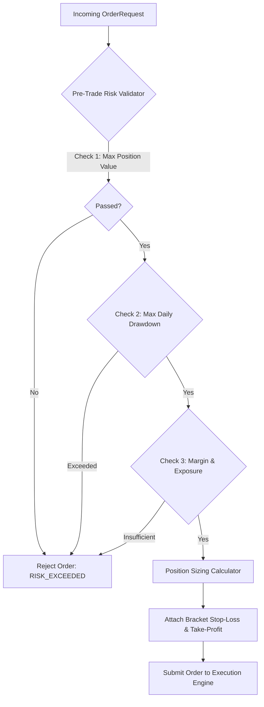

# [Flow 05: Trading] Pre-Trade Risk Management, Position Sizing & Trailing Stop-Loss Engine

**Type**: Core Flow Implementation
**Module**: `trading`
**Labels**: `area:trading`, `core-flow`, `risk-management`, `orders`
**Priority**: High

---

## 1. Overview & Problem Statement
Direct algorithmic order execution without pre-trade risk checks exposes accounts to catastrophic drawdown risks. The trading engine requires an automated **Risk Management Engine** that validates order size against available margin, daily loss limits, single-trade risk parameters (e.g. 1% account risk), and automatically attaches dynamic Bracket Orders (Stop-Loss and Take-Profit with Trailing SL).

---

## 2. Proposed Architecture & Component Flow

---

## 3. Scope of Work

1. **`RiskRuleValidator` Chain**:
   - `AccountBalanceRiskRule`: Checks available cash vs required margin.
   - `MaxPositionSizeRiskRule`: Caps exposure per symbol (e.g., max 10% of portfolio).
   - `DailyLossLimitRiskRule`: Halts new orders if total intraday loss exceeds threshold (e.g., 3%).
   - `KillSwitchRule`: Global circuit breaker check.
2. **`PositionSizeCalculator`**:
   - Computes exact order quantity based on risk amount: `Quantity = (AccountBalance * RiskPercent) / (EntryPrice - StopLossPrice)`.
3. **`BracketOrderManager`**:
   - Automatic execution of Stop-Loss (SL) and Target (TP) OCO (One-Cancels-Other) pairs.
   - Trailing Stop-Loss updater on favorable price movements.

---

## 4. Acceptance Criteria

- [ ] Orders violating any risk rule are rejected with descriptive error codes.
- [ ] Position sizing dynamically calculates quantities from risk percentages.
- [ ] Trailing stop-loss automatically adjusts upward for Long positions as price advances.
- [ ] Unit & integration tests achieve >= 95% line coverage.
