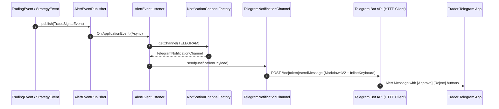

# [Flow 06: Alert] Live Telegram Bot & Discord Webhook Notification Channels

**Type**: Core Flow Implementation
**Module**: `alert`
**Labels**: `area:alert`, `core-flow`, `telegram`, `discord`, `notifications`
**Priority**: Medium

---

## 1. Overview & Problem Statement
Currently, [`NotificationChannelFactory`](file:///Users/dharam.dev/devspace/tragepro-api/src/main/java/com/tragepro/api/alert/core/channel/NotificationChannelFactory.java) routes to basic email and webhook handlers. Traders need instant, mobile-first notifications via **Telegram Bot API** (with interactive inline action buttons to approve/cancel orders) and **Discord Rich Embed Webhooks** for channel alerts.

---

## 2. Proposed Architecture & Component Flow

---

## 3. Scope of Work

1. **`TelegramNotificationChannel`**:
   - Telegram Bot HTTP client using Spring 6 `RestClient`.
   - Rich message formatting with emojis, signal indicators, entry/stop-loss tables, and inline query callbacks.
2. **`DiscordWebhookNotificationChannel`**:
   - Discord Embed builder with color-coded severity (Green for Profit/Buy, Red for Stop-Loss/Sell, Amber for Warning).
3. **Interactive Telegram Callback Webhook** (`/api/v1/alert/callback/telegram`):
   - Handles button clicks (e.g. trader taps "Cancel Order" on Telegram -> calls `OrderAdapter.cancelOrder(...)`).

---

## 4. Acceptance Criteria

- [ ] Telegram notifications deliver within < 500ms of event emission.
- [ ] Discord Webhook embeds formatted cleanly with timestamps and action links.
- [ ] Interactive callback handles button responses securely.
- [ ] Unit & integration tests achieve >= 95% line coverage.
